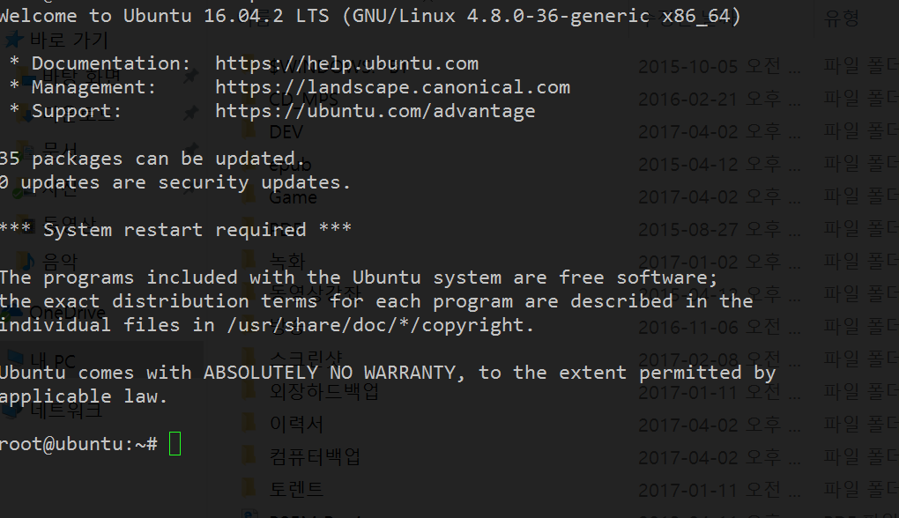

# Ubuntu 16.04 openssh-server

```
sudo apt-get install openssh-server
sudo nano /etc/ssh/sshd_config


PermitRootLogin -> yes로 수정

//systemctl 서비스 관리를 주로하기 위해 명령어?
systemctl restart sshd
```

sudo passwd root -> 패스워드설정해야함

ifconfig로 우분투 아이피확인후 putty로 접속하면됨

