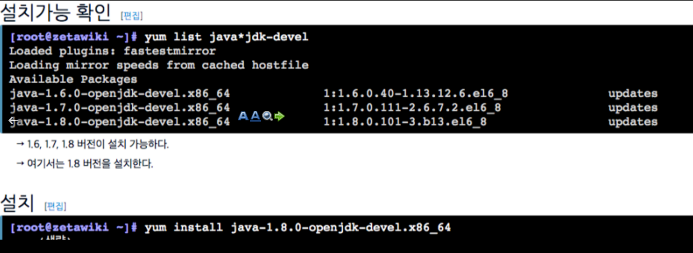
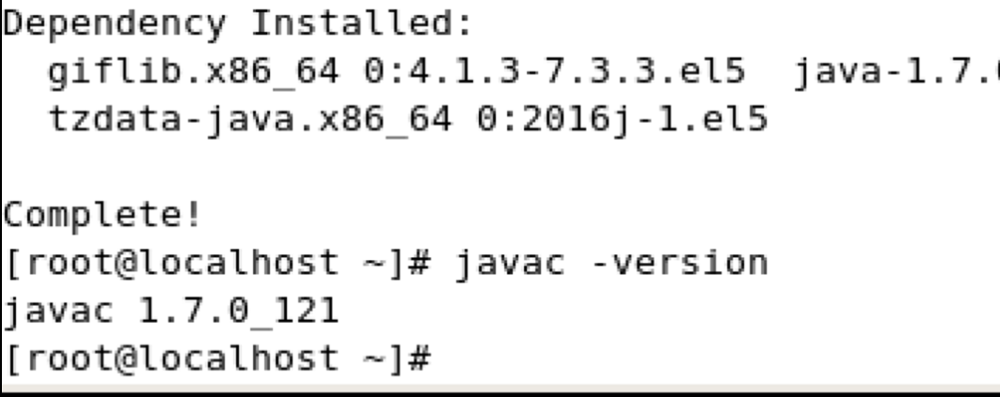

# CentOS Maven 사설 레파지토리 구축

[https://www.sonatype.com/download-oss-sonatype](https://www.sonatype.com/download-oss-sonatype)

- jdk부터 설치를 한다

- 설치후에 java-version 확인 javac -version 

- [http://zetawiki.com/wiki/CentOS_Nexus_%EC%84%A4%EC%B9%98](http://zetawiki.com/wiki/CentOS_Nexus_%EC%84%A4%EC%B9%98)

여기서 etc/init.d/nexus 쉘스크립트가 잘안되었음
